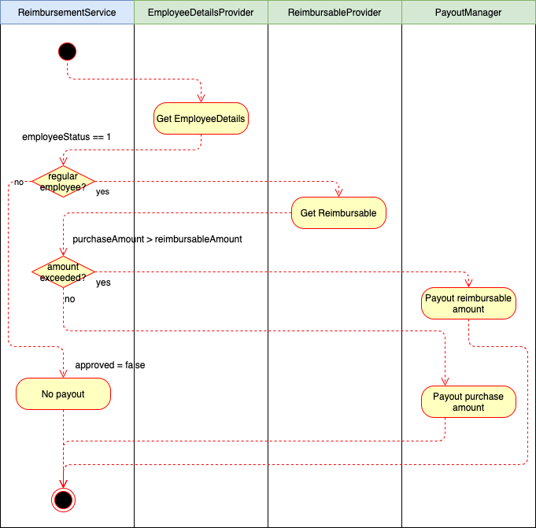

# Exercises on  Interfaces

## 1. Designing an Interface
Design an EchoDot interface which will allow user
* to increase volume
* decrease volume
* mute microphone
* unmute microphone

## 2. Implementing an Interface


## 3. Group Exercise
Design a class ReimbursementServiceImpl such that:
1. a _reimburse()_ method is being implemented from the ReimburseService interface;
2. the method should return a ReimbursementResult which tells whether the reimbursement request has been approved or not together with the approved amount;
3. the logic of the reimbursement approval goes like:



4. the class diagram should look like:


5. To test your design, implement the following interfaces with hardcoded return values:
* EmployeeDetailsProvider
* ReimbursableProvider
* PayoutManager

Create a ReimbursementMain class and in its _main()_ method, instantiate a ReimbursementServiceImpl object

```java
ReimbursementService reimbursementService = new ReimbursementServiceImpl(
    new EmployeeDetailsProviderImpl(),
    new ReimbursableProviderImpl(),
    new PayoutManagerImpl()
);
```

And, instantiate a ReimbursementRequest object and invoke _reimburse()_ method of the reimbursementService object:

```java
// example
ReimbursementRequest request = new ReimbursementRequest(1L, 10000.0, 1L);
ReimbursementResult result = reimbursementService.reimburse(request);
```

Then, print the results and check whether they match with what you expect based on the hard-coded values you set on the implementing classes.
```java
System.out.println("approved: " + result.isApproved());
System.out.println("approvedAmount: " + result.getApprovedAmount());
```
